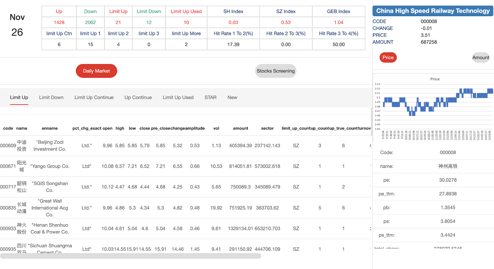
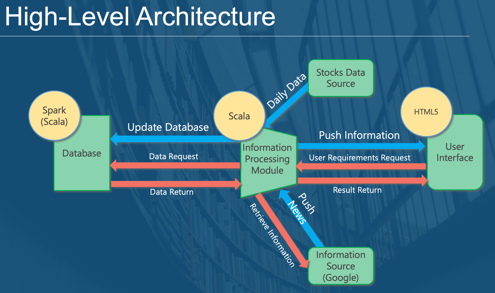
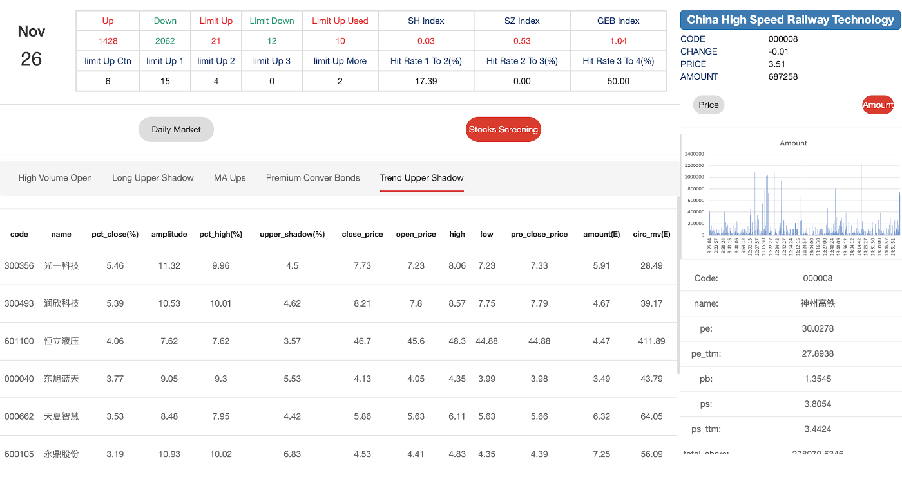

# Chinese Stocks Screening System

A system for stock information displaying and selection recommendation!

## Overview

## High-Level Architecture

### Database (Spark - Scala)
- Store the historical data (original data and processed data)
- Store the data and statistics after daily calculation and processing by the system
- Respond to data requests from the system 
### Information Processing Module (Scala)
- Obtain daily stock data from data sources (stock exchange)
- Update and manage the Database
- Calculate and statistics daily stock information - Overview of the market
- Recommend stocks to users by several strategies
- Send result to the User Interface 
### User Interface (HTML5)
- Display daily stock information
- Overview statistics for sentiment analysis of the whole market
- Details of selected stock - daily information, charts, and company information
- Recommend stocks picking by strategies

## Data Analysis
- Daily Source Data
 - Daily stocks and indices information got from the internet
- Daily Market Data
 - Daily data calculated by the Information Processing Module
- Overview Data
 - The trend and statistics information of the market
- Screener Data
 - Stocks selected by strategies
- Company Information Data
 - Financial Data of Listed Companies
- Tick Data
 - Trading information per second of stocks
- Trading Calendar
 - The Calendar of trading days for trading markets

## Information Processing Module
- Daily Market 
 - Calculate and analyze daily data from source data
- Details
 - Overview of the trend and statistics information of the market
 - Output the information for the selected company 
- Screener
 - Calculate stocks recommendation in different strategies
 - Top-20 stocks for each strategy
- Utils
 - Utilities classes and methods
- Main
 - The object to run the whole program

## User Interface (HTML5)
- Daily Market 

- Stocks Screening 

